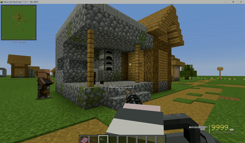

# Block Durability (Forge 1.20.1)

方块耐久系统——给方块加上血量，用 TaCZ 枪械射击可破坏玻璃、木板等方块。

<p align="center">
  <a href="assets/block-durability-demo.gif">
    
  </a>
</p>

> 此分支为 **Forge 1.20.1** 移植版。NeoForge 1.21.1 原版见 `master` 分支。

> ⚠️ **AI 生成声明**：本项目代码部分由 AI 辅助生成，已通过人工审查和验证。如有疑虑请自行审计源码。

> ⚠️ **兼容性声明**：本模组依赖 TACZ 内部 API（`AmmoHitBlockEvent` / `EntityKineticBullet`），未在所有模组环境下进行全覆盖测试。如遇问题请提交 Issue。

## 功能

- 方块基于硬度自动计算血量
- 支持 Tag / 通配符白名单（默认覆盖玻璃、木板、原木、木门等）
- 裂纹进度条实时显示破坏程度
- 粒子特效 + 音效反馈
- 按方块单独覆盖血量（如 `minecraft:obsidian=20`）
- TACZ 可选依赖，未安装时自动静默
- **栅栏修复**（v1.1.0）：通过 Mixin 劫持 TACZ 的 `bullet_ignore` 标签，使栅栏和栅栏门可被子弹命中

## 默认可破坏方块

| 类别 | Tag |
|---|---|
| 玻璃 | `tag:c:glass_blocks` / `tag:c:glass_panes` |
| 木板 | `tag:minecraft:planks` |
| 原木 | `tag:minecraft:logs` |
| 木门 | `tag:minecraft:wooden_doors` |
| 木活板门 | `tag:minecraft:wooden_trapdoors` |
| 木栅栏 | `tag:minecraft:fences` |
| 栅栏门 | `tag:minecraft:fence_gates` |
| 木楼梯 | `tag:minecraft:wooden_stairs` |
| 木半砖 | `tag:minecraft:wooden_slabs` |
| 木按钮/压力板 | `tag:minecraft:wooden_buttons` / `wooden_pressure_plates` |
| 告示牌 | `tag:minecraft:standing_signs` 等 |

## 构建

```bash
./gradlew build
```

## 依赖

- **Minecraft Forge** 1.20.1 (47.3+)
- **TaCZ** (Timeless and Classics Zero) 1.20.1 — 可选

## 配置

配置文件位于 `config/blockdurability-common.toml`：

```toml
[general]
    enabled = true
    damagePerHit = 1.0
    fixBulletIgnore = true      # 修复栅栏穿透（v1.1.0+ 默认开启）

[whitelist]
    blockWhitelist = [
        "tag:c:glass_blocks",
        "tag:minecraft:planks",
        # 支持 tag: / ID / 通配符 三种格式
    ]

[hp_calculation]
    hardnessMultiplier = 1.5
    blockHPOverrides = []       # "minecraft:obsidian=50"

[effects]
    dropItems = false
```

## 升级与故障排除

升级 mod 后新增配置项未出现？删除 `config/blockdurability-common.toml`，重启游戏自动重建。

## 移植说明

| 差异 | NeoForge 1.21.1 (master) | Forge 1.20.1 (本分支) |
|---|---|---|
| 构建 | NeoGradle | ForgeGradle 6.x |
| Java | 21 | 17 |
| 主类构造 | `(IEventBus, ModContainer)` | `()` 无参 |
| 配置类 | `ModConfigSpec` | `ForgeConfigSpec` |
| 事件总线 | `NeoForge.EVENT_BUS` | `MinecraftForge.EVENT_BUS` |
| TACZ 依赖 | Modrinth | CurseMaven |

## License

MIT
